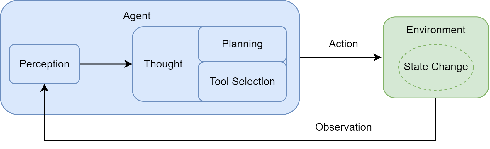
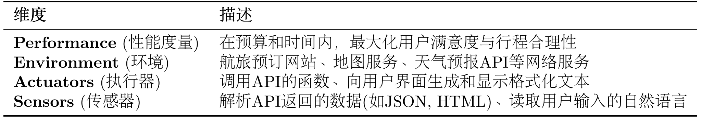
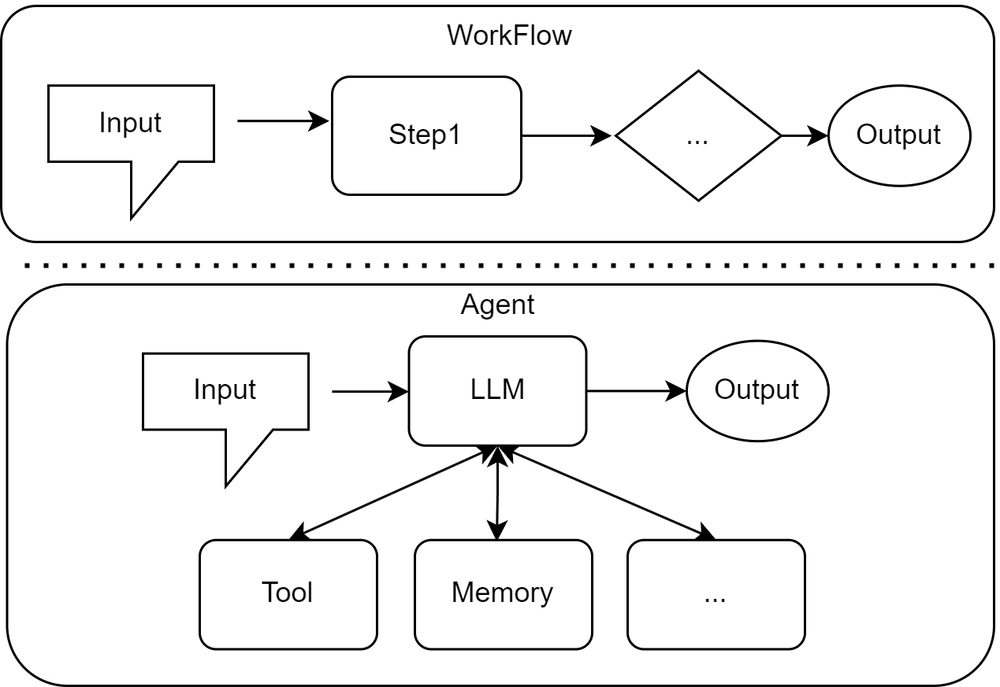

# 如果判断是否是智能体

关键判断标准：智能体必须具备"感知-决策-行动"的完整闭环、自主性和目标导向性
# 智能体运行机制

## PEAS 模型
通常 PEAS 模型是用来精确描述一个任务环境，即分析其性能度量(Performance)、环境(Environment)、执行器(Actuators)和传感器(Sensors)
本系统中的PEAS的模型

# Workflow 与 Agent区别

工作流：
优点：开发简单、结果确定可预测，不存在ai幻觉，性能高
缺点：每次新增规则都需要修改代码，只能处理固定的问题

Agent：
优点：灵活能够自己理解问题并处理，并不一定是预设的问题，业务适应，政策调整只需要更新知识库，基本不需要修改代码
缺点：不确定性（无法保障执行结果确定），成本高（开发成本、模型成本），延迟高